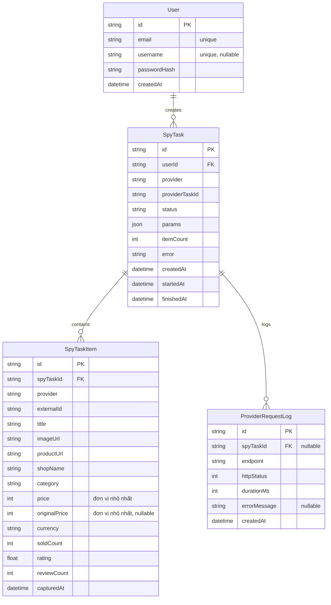

# Mô hình dữ liệu

## ERD



## Vai trò của `SpyTaskItem`

`SpyTaskItem` lưu kết quả **thô** của một lần spy. Mỗi sản phẩm tìm được trong một `SpyTask` là **một dòng insert mới**, không bao giờ update. Bấm vào một `SpyTask` trong sidebar → query `SpyTaskItem WHERE spyTaskId = X` → hiện đúng dữ liệu tại thời điểm lần đó.

Cùng một sản phẩm thật xuất hiện ở nhiều lần spy khác nhau sẽ có nhiều dòng độc lập trong `SpyTaskItem` (mỗi dòng là ảnh chụp tại thời điểm lần đó) — không tự động gộp lại thành một bản ghi duy nhất. Nếu cần một trang liệt kê "tất cả sản phẩm, không trùng lặp", có thể lấy trực tiếp từ `SpyTaskItem` bằng truy vấn "dòng mới nhất cho mỗi `(provider, externalId)`" (Postgres `DISTINCT ON`), không cần đổi schema.

## Quy ước

- **Tiền tệ:** lưu dạng số nguyên ở đơn vị nhỏ nhất (cent, không dùng `float`). Provider trả `price` dạng thập phân đô la (ví dụ `12.9`) — adapter phải nhân `100` và làm tròn trước khi lưu. `currency` lấy trực tiếp từ field `currency` của provider; cấu hình `SPY_DEFAULT_CURRENCY` (mặc định `"USD"`) chỉ dùng làm giá trị dự phòng khi provider không trả field này.
- **`originalPrice` (nullable):** giá gốc trước giảm — nullable vì không phải provider nào cũng trả field này.
- **Thời gian:** mọi `datetime` lưu UTC; quy đổi timezone chỉ thực hiện ở tầng hiển thị (UI). `capturedAt` mặc định bằng thời điểm insert (lúc `SpyTask` chuyển `SUCCEEDED`).
- **`userId` bắt buộc trên `SpyTask`:** không nullable — mọi task thuộc về đúng một người dùng ngay từ đầu (đáp ứng NFR-06). `SpyTaskItem` không cần cột `userId` riêng — quyền truy cập luôn đi qua `SpyTask` (kiểm tra `spyTask.userId` trước khi cho xem `items` của nó), tránh trùng lặp logic phân quyền ở hai chỗ.
- **Không có ràng buộc duy nhất trên `SpyTaskItem`:** mỗi dòng là một bản ghi độc lập theo từng lần spy — trùng `externalId` giữa nhiều dòng là **có chủ đích**, không phải lỗi dữ liệu.
- **Idempotency:** worker kiểm tra `SpyTask.status` trước khi xử lý — nếu đã ở trạng thái kết thúc (`SUCCEEDED`/`FAILED`/`TIMEOUT`) thì bỏ qua, không insert lại `SpyTaskItem` (job chạy lại do lỗi/restart không tạo dòng trùng).

## Bản nháp `schema.prisma`

Dùng lại trực tiếp ở giai đoạn scaffold:

```prisma
generator client {
  provider = "prisma-client-js"
}

datasource db {
  provider = "postgresql"
  url      = env("DATABASE_URL")
}

enum SpyTaskStatus {
  PENDING
  RUNNING
  SUCCEEDED
  FAILED
  TIMEOUT
}

model User {
  id           String   @id @default(cuid())
  email        String   @unique
  username     String?  @unique
  passwordHash String
  createdAt    DateTime @default(now())

  spyTasks SpyTask[]
}

model SpyTask {
  id             String        @id @default(cuid())
  userId         String
  provider       String
  providerTaskId String
  status         SpyTaskStatus @default(PENDING)
  params         Json
  itemCount      Int           @default(0)
  error          String?
  createdAt      DateTime      @default(now())
  startedAt      DateTime?
  finishedAt     DateTime?

  user  User                 @relation(fields: [userId], references: [id])
  items SpyTaskItem[]
  logs  ProviderRequestLog[]

  @@unique([provider, providerTaskId])
  @@index([userId, createdAt])
}

model SpyTaskItem {
  id             String   @id @default(cuid())
  spyTaskId      String
  provider       String
  externalId     String
  title          String
  imageUrl       String
  productUrl     String
  shopName       String?
  category       String?
  price          Int
  originalPrice  Int?
  currency       String
  soldCount      Int?
  rating         Float?
  reviewCount    Int?
  capturedAt     DateTime @default(now())

  spyTask SpyTask @relation(fields: [spyTaskId], references: [id])

  @@index([spyTaskId])
  @@index([provider, externalId, capturedAt(sort: Desc)])
}

model ProviderRequestLog {
  id           String   @id @default(cuid())
  spyTaskId    String?
  endpoint     String
  httpStatus   Int
  durationMs   Int
  errorMessage String?
  createdAt    DateTime @default(now())

  spyTask SpyTask? @relation(fields: [spyTaskId], references: [id])

  @@index([spyTaskId])
}
```
