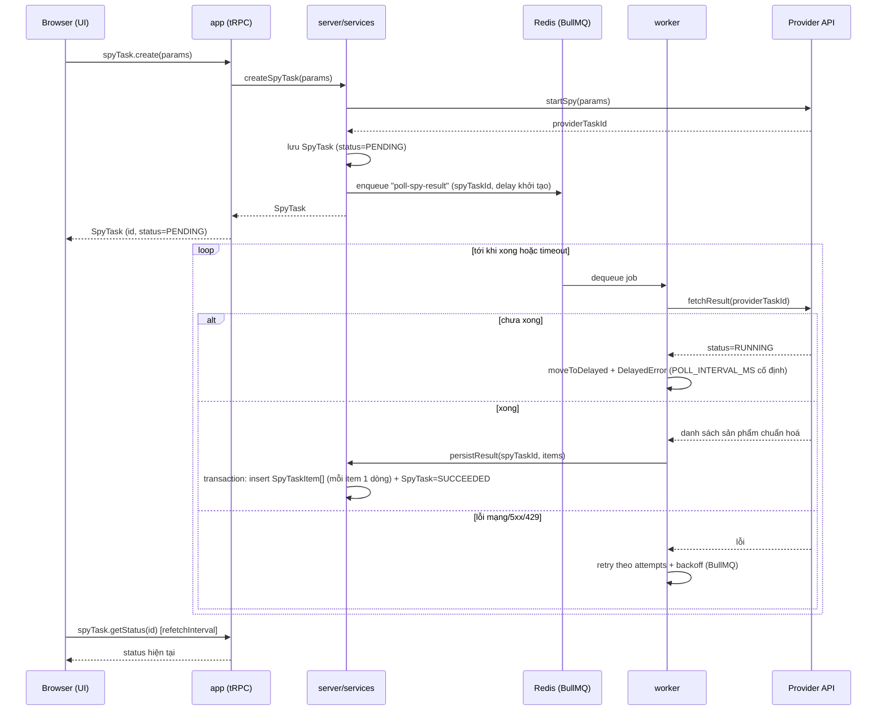

# Luồng xử lý Job (Spy Pipeline)

## Sơ đồ tuần tự

## Chi tiết từng bước

1. **Khởi tạo (đồng bộ, trong request HTTP):** UI gọi mutation tRPC `spyTask.create` với `keyword` (Zod validate ở input). Router lấy `userId` từ session đăng nhập (context tRPC, xem [ADR-0005](../03-decisions/adr-0005-authjs-jwt-cho-xac-thuc.md)) — không tin tham số `userId` gửi từ client. Service gọi `provider.startSpy(params)`, nhận `providerTaskId`, tạo bản ghi `SpyTask` với `status = PENDING`, gắn `userId`.

2. **Đẩy job:** ngay sau khi tạo `SpyTask`, service đẩy job `poll-spy-result` vào BullMQ với `spyTaskId`, delay khởi tạo `POLL_INITIAL_DELAY_MS`.

3. **Worker poll:** worker dequeue job, gọi `provider.fetchResult(providerTaskId)` — với adapter Apify, một lệnh gọi này có thể thực hiện tới 2 request HTTP bên trong (kiểm tra trạng thái run, rồi mới lấy dữ liệu nếu đã xong; xem [external-spy-api.md](../04-integration/external-spy-api.md)), nhưng worker chỉ thấy một kết quả `SpyResult` duy nhất:
   - **Chưa xong:** gọi `job.moveToDelayed(Date.now() + POLL_INTERVAL_MS, token)` rồi `throw new DelayedError()` để nhả lock và lên lịch lại — theo đúng pattern khuyến nghị của BullMQ cho "process step jobs". Dùng **khoảng cách cố định** (`POLL_INTERVAL_MS`) giữa các lần poll, không tăng dần — vì actor có giới hạn thời gian chạy đã biết trước (xem bảng tham số bên dưới), không cần dè dặt kiểu backoff luỹ thừa như khi xử lý lỗi.
   - **Xong:** adapter provider chuẩn hoá từng item thành `NormalizedSpyItem` — chuyển `price` từ đô la thập phân sang cent số nguyên, lấy `currency` trực tiếp từ provider (fallback `SPY_DEFAULT_CURRENCY` nếu thiếu) — rồi gọi `persistResult` trong **một Prisma transaction**: `createMany` các dòng `SpyTaskItem` (mỗi sản phẩm tìm được là một dòng mới, gắn `spyTaskId` — không upsert, không kiểm tra trùng với lần spy trước). Đồng thời cập nhật `SpyTask.status = SUCCEEDED` và `itemCount`.
   - **Lỗi mạng/5xx/429 khi gọi Apify:** khác với case "chưa xong" ở trên — đây là lỗi giao tiếp, không phải trạng thái hợp lệ. Để BullMQ retry tự nhiên theo cấu hình cố định trên queue (`attempts: 3`, `backoff: { type: 'exponential', delay: 2000 }`) — không đọc từ biến môi trường, vì đây là hành vi kỹ thuật nội bộ của queue, không phụ thuộc provider. Rate limit thật của Apify (xem [external-spy-api.md](../04-integration/external-spy-api.md)) cao hơn nhiều so với tần suất gọi thực tế của hệ thống nên `429` gần như không xảy ra — retry này chỉ để phòng hờ.
   - **Vượt tổng thời gian cho phép** (so `Date.now() - spyTask.createdAt` với `POLL_TIMEOUT_MS`): cập nhật `SpyTask.status = TIMEOUT`, ghi `error`, không tiếp tục poll.

4. **UI theo dõi:** trang task dùng tRPC query `spyTask.getStatus(id)` với `refetchInterval` (ví dụ 2s) khi `status` còn `PENDING`/`RUNNING`, tự dừng poll khi vào trạng thái kết thúc. Chọn cách này thay vì WebSocket vì đơn giản hơn nhiều mà vẫn đủ đáp ứng ở quy mô một người dùng.

## Tham số polling (chờ Apify, không phải lỗi mạng)

Actor Apify được cấu hình `timeout: 60` (giây) trong body `startSpy` — đây là giới hạn actor **tự dừng chính nó**, không phải chu kỳ poll của worker. Container Apify còn cần thời gian khởi động trước khi actor bắt đầu chạy, nên tổng thời gian thực tế thường vượt 60s.

| Biến môi trường | Giá trị mặc định | Ý nghĩa |
|---|---|---|
| `POLL_INITIAL_DELAY_MS` | `20000` (20s) | Chờ trước lần poll đầu tiên — actor cần thời gian khởi động container, poll sớm hơn gần như chắc chắn nhận `RUNNING`. |
| `POLL_INTERVAL_MS` | `10000` (10s) | Khoảng cách cố định giữa các lần poll sau đó. |
| `POLL_TIMEOUT_MS` | `180000` (3 phút) | Tổng thời gian tối đa chờ một task — gấp 3 lần timeout 60s của actor, chừa dư cho overhead khởi động container và độ trễ mạng. Quá mốc này, task chuyển `TIMEOUT`. |

Với các giá trị mặc định trên, một task có tối đa `(180000 − 20000) / 10000 = 16` lần poll trước khi hết hạn.

## Concurrency

Worker dùng **concurrency mặc định của BullMQ (`1`)** — xử lý một job `poll-spy-result` tại một thời điểm, không cấu hình `concurrency` tuỳ chỉnh. Nhiều `SpyTask` cùng `PENDING`/`RUNNING` vẫn xếp hàng bình thường trong Redis, chỉ là worker xử lý tuần tự thay vì song song. Ở quy mô hiện tại (kích hoạt thủ công, ít người dùng) không ảnh hưởng trải nghiệm; tăng `concurrency` là một tham số cấu hình đơn giản nếu cần sau này.

## Idempotency

- `SpyTaskItem` chỉ insert, không upsert — idempotency đến từ việc **kiểm tra trạng thái trước khi ghi**: worker kiểm tra `SpyTask.status` hiện tại trong DB trước khi xử lý — nếu đã ở trạng thái kết thúc (`SUCCEEDED`/`FAILED`/`TIMEOUT`) thì bỏ qua job, không insert lại (tránh nhân đôi `SpyTaskItem` nếu job chạy lại do lỗi/restart).
- `persistResult` chạy trong transaction để việc insert `SpyTaskItem[]` + cập nhật `SpyTask.status = SUCCEEDED` là một đơn vị nguyên tử — job bị crash giữa chừng sẽ không để lại trạng thái nửa vời (ví dụ: đã insert item nhưng `SpyTask` vẫn `PENDING`, khiến worker xử lý lại và tạo trùng).
