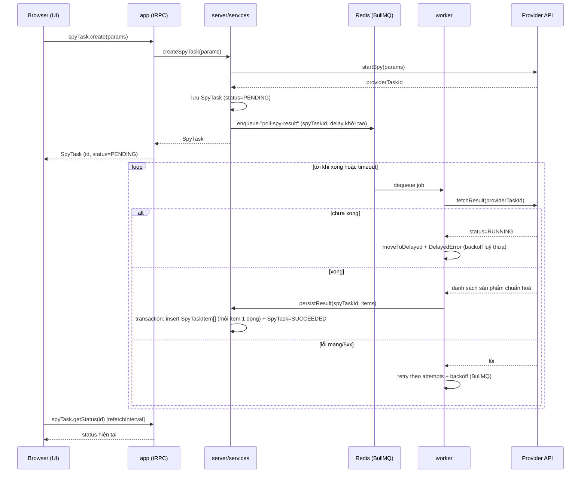

# Luồng xử lý Job (Spy Pipeline)

## Sơ đồ tuần tự

## Chi tiết từng bước

1. **Khởi tạo (đồng bộ, trong request HTTP):** UI gọi mutation tRPC `spyTask.create` với `keyword` (Zod validate ở input). Router lấy `userId` từ session đăng nhập (context tRPC, xem [ADR-0005](../03-decisions/adr-0005-authjs-jwt-cho-xac-thuc.md)) — không tin tham số `userId` gửi từ client. Service gọi `provider.startSpy(params)`, nhận `providerTaskId`, tạo bản ghi `SpyTask` với `status = PENDING`, gắn `userId`.

2. **Đẩy job:** ngay sau khi tạo `SpyTask`, service đẩy job `poll-spy-result` vào BullMQ với `spyTaskId` và một `delay` khởi tạo (thời gian ước lượng provider cần để xử lý lần đầu — cấu hình qua biến môi trường).

3. **Worker poll:** worker dequeue job, gọi `provider.fetchResult(providerTaskId)`:
   - **Chưa xong:** gọi `job.moveToDelayed(Date.now() + nextDelay, token)` rồi `throw new DelayedError()` để nhả lock và lên lịch lại — theo đúng pattern khuyến nghị của BullMQ cho "process step jobs". `nextDelay` tăng theo backoff luỹ thừa có giới hạn trần.
   - **Xong:** adapter provider chuẩn hoá từng item thành `NormalizedSpyItem` — bao gồm chuyển `price`/`original_price` từ đô la thập phân sang cent số nguyên, gán `currency` từ `SPY_DEFAULT_CURRENCY` (xem [external-spy-api.md](../04-integration/external-spy-api.md)) — rồi gọi `persistResult` trong **một Prisma transaction**: `createMany` các dòng `SpyTaskItem` (mỗi sản phẩm tìm được là một dòng mới, gắn `spyTaskId` — không upsert, không kiểm tra trùng với lần spy trước). Đồng thời cập nhật `SpyTask.status = SUCCEEDED` và `itemCount`.
   - **Lỗi mạng/5xx:** để BullMQ retry tự nhiên theo `attempts` + `backoff` cấu hình trên queue.
   - **Vượt tổng thời gian cho phép** (so `Date.now() - spyTask.createdAt` với `POLL_TIMEOUT_MS`): cập nhật `SpyTask.status = TIMEOUT`, ghi `error`, không tiếp tục poll.

4. **UI theo dõi:** trang task dùng tRPC query `spyTask.getStatus(id)` với `refetchInterval` (ví dụ 2s) khi `status` còn `PENDING`/`RUNNING`, tự dừng poll khi vào trạng thái kết thúc. Chọn cách này thay vì WebSocket vì đơn giản hơn nhiều mà vẫn đủ đáp ứng ở quy mô một người dùng.

## Idempotency

- `SpyTaskItem` chỉ insert, không upsert — idempotency đến từ việc **kiểm tra trạng thái trước khi ghi**: worker kiểm tra `SpyTask.status` hiện tại trong DB trước khi xử lý — nếu đã ở trạng thái kết thúc (`SUCCEEDED`/`FAILED`/`TIMEOUT`) thì bỏ qua job, không insert lại (tránh nhân đôi `SpyTaskItem` nếu job chạy lại do lỗi/restart).
- `persistResult` chạy trong transaction để việc insert `SpyTaskItem[]` + cập nhật `SpyTask.status = SUCCEEDED` là một đơn vị nguyên tử — job bị crash giữa chừng sẽ không để lại trạng thái nửa vời (ví dụ: đã insert item nhưng `SpyTask` vẫn `PENDING`, khiến worker xử lý lại và tạo trùng).
