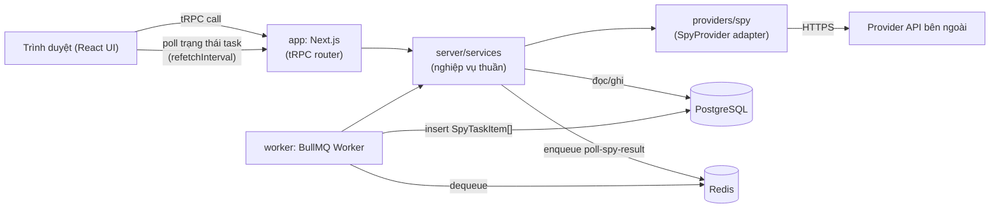

# Kiến trúc hệ thống

## Container

Bốn container chạy trong Docker Compose:

- **`app`** — Next.js: phục vụ UI (React), endpoint tRPC (`/api/trpc`), và xác thực (`/api/auth/*` — Auth.js). Xử lý các thao tác đồng bộ nhanh: đăng ký/đăng nhập, tạo `SpyTask`, đọc sidebar lịch sử/chi tiết kết quả một lần spy.
- **`worker`** — Process Node riêng biệt, chạy BullMQ worker. Xử lý polling `taskId` tới provider — việc chậm, không đồng bộ, không thuộc vòng đời request HTTP.
- **`postgres`** — Lưu trữ chính: `User`, `SpyTask`, `SpyTaskItem`, `ProviderRequestLog`.
- **`redis`** — Hàng đợi job cho BullMQ.

`app` và `worker` **dùng chung một source code** (cùng `src/server/services`, cùng Prisma Client) nhưng là hai tiến trình Node độc lập — đây là cách giữ "một source" mà vẫn có tiến trình nền thật sự, không bị chặn bởi vòng đời request của Next.js. Xem [ADR-0001](../03-decisions/adr-0001-fullstack-nextjs-single-source.md).

## Sơ đồ luồng dữ liệu

## Nguyên tắc

- **Một chiều phụ thuộc:** `app` và `worker` đều gọi vào `server/services`; `services` không phụ thuộc ngược lại vào `app` hay `worker`. Chi tiết tại [project-structure.md](project-structure.md).
- **Provider bị cô lập:** `services` không gọi HTTP trực tiếp tới provider — luôn đi qua interface `SpyProvider` trong `providers/spy`. Đổi provider = viết thêm một adapter, không sửa `services`.
- **Trạng thái là nguồn sự thật duy nhất:** UI không giữ trạng thái task ở client; mọi trạng thái đọc từ `SpyTask` trong DB qua tRPC.
- **Cách ly theo người dùng ở tầng service, không phải tầng UI:** `userId` lấy từ JWT session (Auth.js) ngay trong context tRPC, mọi hàm `services` đọc/ghi `SpyTask` đều lọc theo `userId` này; truy cập `SpyTaskItem` luôn đi qua kiểm tra `spyTask.userId` trước — ẩn nút bấm trên UI không được xem là biện pháp cách ly dữ liệu. Xem [ADR-0005](../03-decisions/adr-0005-authjs-jwt-cho-xac-thuc.md).
